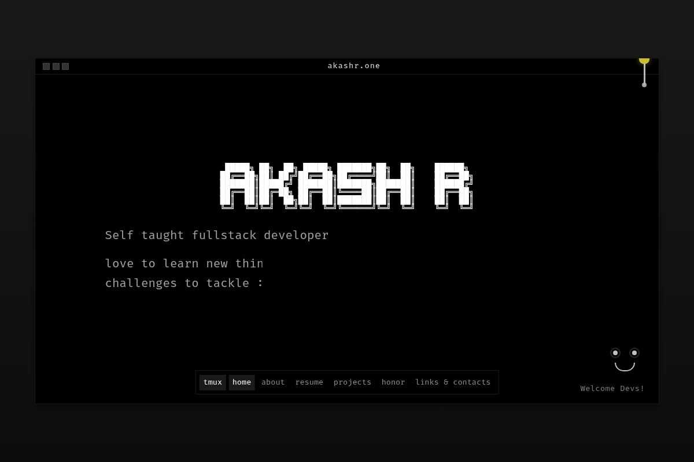
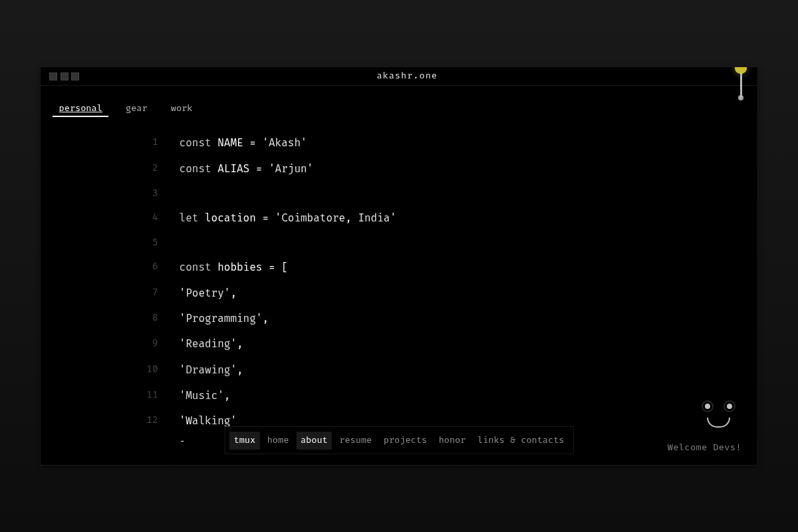
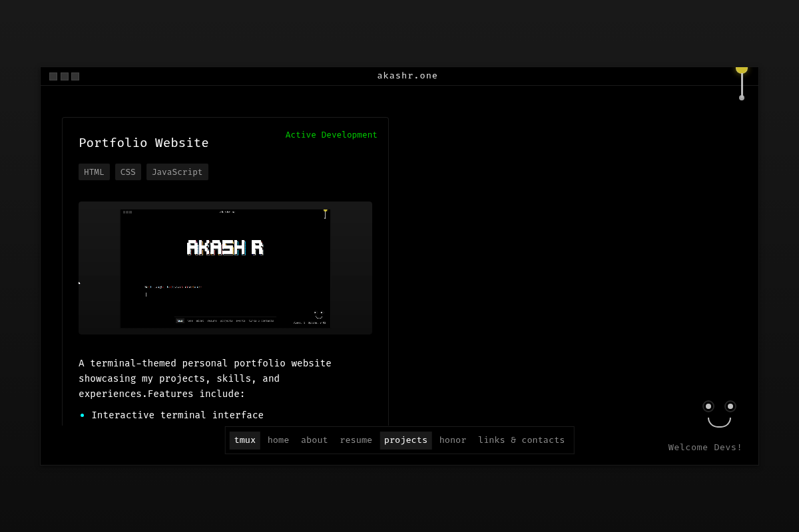

# Akash Rengaraj | Terminal Portfolio
[](https://akashr.one/)



A unique, terminal-themed personal portfolio website built with **React** and **Vite**. It features a command-line interface aesthetic, interactive elements, and a seamless user experience.

## 🚀 Features

- **Terminal Interface**: A custom-built terminal UI with typing effects and command-line aesthetics.
- **Interactive Navigation**: Navigate through sections like Home, About, Projects, and Events using the terminal or clickable links.
- **Theme System**: Toggle between Dark (Hacker) and Light modes.
- **Eye-Tracking Animation**: Fun, interactive eyes that follow your cursor.
- **Responsive Design**: Fully responsive layout that works on desktop and mobile.
- **Real-time Stats**: Page view counter powered by Firebase.

## 📸 Screenshots

### About Section


### Projects Showcase


## 🛠️ Tech Stack

- **Frontend**: React, Vite
- **Styling**: CSS3 (Custom Variables, Animations)
- **Backend/Database**: Firebase (Realtime Database for stats)
- **Deployment**: Vercel / Netlify (Recommended)

## 🏃‍♂️ Running Locally

1.  **Clone the repository**
    ```bash
    git clone https://github.com/Akash-rengaraj/Personal-Portfolio.git
    cd Personal-Portfolio
    ```

2.  **Install dependencies**
    ```bash
    npm install
    ```

3.  **Start the development server**
    ```bash
    npm run dev
    ```

4.  Open `http://localhost:5173` in your browser.

## 📝 License

This project is open source and available under the [MIT License](LICENSE).

---
*Built with ❤️ by Akash Rengaraj*
